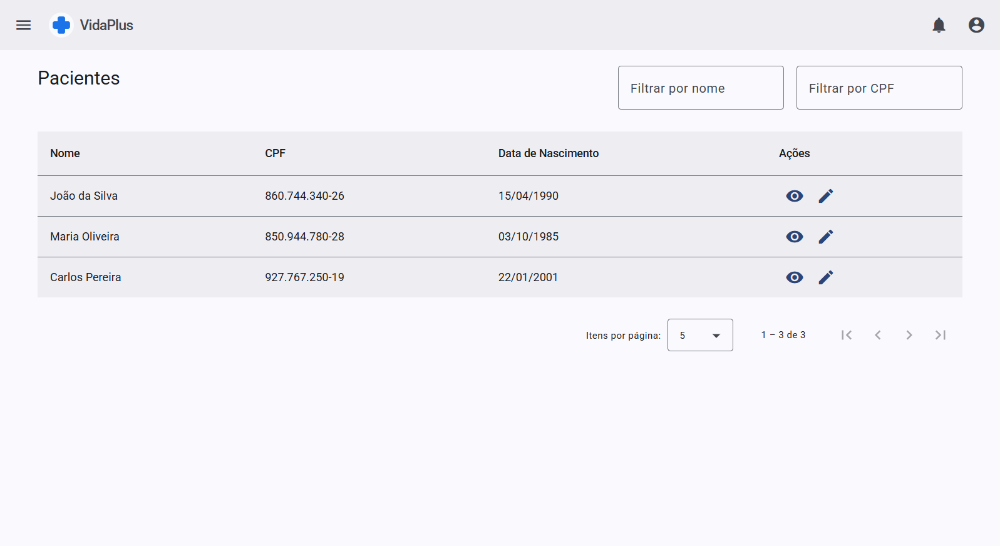
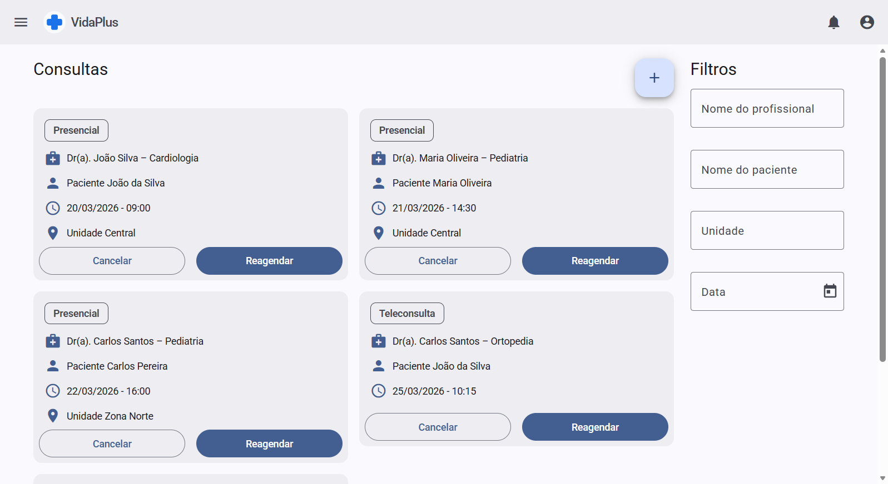

<h1 align="center">VidaPlus — Sistema de Gestão de Saúde</h1>

<p align="center">
  Aplicação web frontend desenvolvida com <strong>Angular 19</strong>, simulando um sistema de gestão hospitalar com diferentes perfis de acesso e módulos administrativos.
</p>

<p align="center">
  <a href="https://vidaplus-sistema-hospitalar.vercel.app/">
    <strong>🔗 Acessar demonstração</strong>
  </a>
</p>

<p align="center">
  
  
  
  
  
</p>

> **Projeto de portfólio:** os dados e a autenticação são simulados localmente utilizando `localStorage`. O projeto não possui backend, API ou banco de dados próprio.

## Destaques

* Autenticação e controle de acesso por perfil
* Rotas protegidas com Guards
* Gerenciamento de estado com **NgRx**
* Persistência e reidratação do estado
* Lazy Loading
* Interfaces responsivas com **Angular Material** e **Tailwind CSS**
* Componentes reutilizáveis
* Formulários reativos e validações
* CRUDs para diferentes entidades do sistema

## Arquitetura

O projeto utiliza uma organização baseada em **Core, Features e Shared**, separando responsabilidades e funcionalidades por domínio.

O gerenciamento de estado segue o fluxo:

```text
Component
    ↓
 Action
    ↓
 Effect
    ↓
 Service
    ↓
Reducer
    ↓
Selector
    ↓
Component
```

A camada de serviços foi estruturada de forma que a persistência local possa futuramente ser substituída por uma API.

## Tecnologias

| Tecnologia           | Utilização                             |
| -------------------- | -------------------------------------- |
| **Angular 19**       | Framework principal                    |
| **TypeScript**       | Linguagem                              |
| **NgRx**             | Gerenciamento de estado                |
| **RxJS**             | Programação reativa                    |
| **Angular Material** | Componentes e UI                       |
| **Tailwind CSS**     | Estilização e responsividade           |
| **Angular CDK**      | Recursos de interface e responsividade |
| **Reactive Forms**   | Formulários e validações               |
| **ESLint**           | Análise e padronização de código       |
| **Karma / Jasmine**  | Testes                                 |

## Preview

<p align="center">
  
</p>

<p align="center">
  
  
</p>

## Executando localmente

### 1. Clone o repositório

```bash
git clone https://github.com/gustavodacostap/vidaplus.git
cd vidaplus
```

### 2. Instale as dependências

```bash
npm install
```

### 3. Inicie a aplicação

```bash
npm start
```

A aplicação estará disponível em:

```text
http://localhost:4200
```

## Usuários para demonstração

| Perfil        | E-mail                      | Senha         |
| ------------- | --------------------------- | ------------- |
| Administrador | `admin@vidaplus.com`        | `admin123`    |
| Profissional  | `profissional@vidaplus.com` | `profi123`    |
| Paciente      | `paciente@vidaplus.com`     | `paciente123` |

## Status

**Frontend funcional para demonstração e portfólio.**

O projeto atualmente não possui:

* Backend ou API
* Banco de dados
* Autenticação real
* Testes automatizados abrangentes

Os dados utilizados pela aplicação são simulados localmente.
